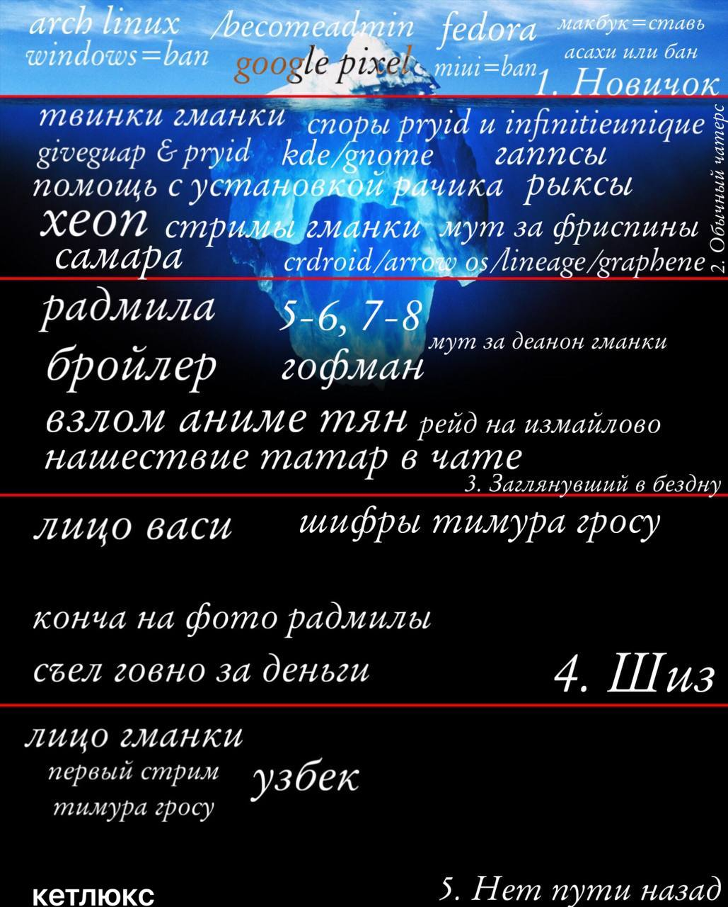

# Айсберг Тимура Гросу

18 августа 2023 года канал gmanka опубликовал исправленный айсберг раннего gmankachat с подписью `by @grosuchannel`.

## 1. Новичок

Arch Linux, `/becomeadmin`, Fedora, «макбук = смерть», `windows = ban`, Google Pixel, MIUI-бан и Asahi — публичная техническая идеология чата.

## 2. Обычный в чатере

Твинки gmanka, споры прид и infinitieunique, Giveguap & прид, KDE/GNOME, записи, помощь с установкой Arch, RX/Xeon, стримы, Самара и мобильные прошивки требуют уже регулярного чтения чата.

## 3. Заглянувший в бездну

Радмила, `5-6, 7-8`, Бройлер, Гофман, мут за деанон gmanka, взлом Аниме тян, рейд на Измайлово и «нашествие татар» — персональный ранний лор. В обсуждении gmanka пояснял «татар» как себя, Радмилу и Диану; Василиса добавляла других участников.

## 4. Шиз

Лицо Васи, шифры Тимура Гросу, лицо gmanka, испорченное фото Радмилы и «съел говно за деньги» — закрытые изображения и истории, которые уже в день публикации не объясняли. На вопрос Василисы Тимур ответил только: «это шизовый секрет». Вики не назначает участника без источника.

## 5. Нет пути назад

Лицо gmanka, первый стрим, [Тимур Гросу](../participants/тимур-гросу.md) и Узбек обозначают доступ к ранним медиа и людям, а не объективный рейтинг важности.

## Разбор структуры

Чем глубже слой, тем меньше технологий и больше лиц, телесных историй и закрытых медиа. Айсберг — снимок августа 2023 года: в нём ещё нет ГРМ, Носача, 600 BYN и поздних оконных менеджеров. Именно историческая ограниченность делает его ценным.

---
Категории: [История](README.md) · [Мемы](../memes/README.md)
